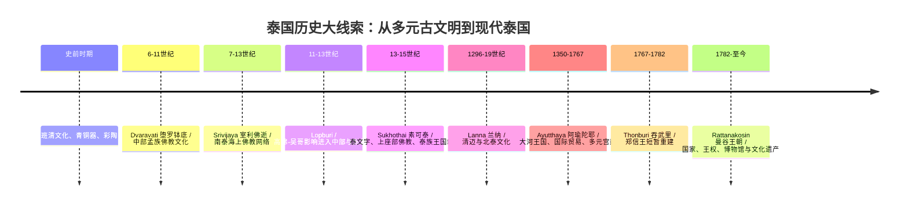
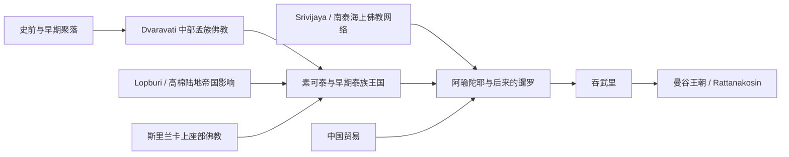

---
{"aliases":["Bangkok National Museum Room 4 and 5","曼谷国家博物馆 Lopburi Srivijaya","泰国历史入门"],"tags":["travel/thailand","museum/bangkok-national-museum","history/southeast-asia","art-history"],"created":"2026-06-17","status":"旅行前导览","dg-publish":true,"permalink":"/曼谷国家博物馆/","dgPassFrontmatter":true,"noteIcon":"2","dg-note-properties":{"aliases":["Bangkok National Museum Room 4 and 5","曼谷国家博物馆 Lopburi Srivijaya","泰国历史入门"],"tags":["travel/thailand","museum/bangkok-national-museum","history/southeast-asia","art-history"],"created":"2026-06-17","status":"旅行前导览"}}
---

#历史 #泰国
# 曼谷国家博物馆 4、5展厅导览：高棉陆地帝国、室利佛逝海上网络与泰国历史的形成

> [!tip] 这篇笔记怎么用
> 去曼谷国家博物馆前，先读“核心判断”和“时间轴”；进馆后重点看 4、5 展厅里的造像、铭文、蛇神、菩萨和印度教神像。  
> 这两个展厅的意义不是“看几尊佛像”，而是看懂：**泰国不是突然从素可泰开始的，而是在孟族、高棉、南部海贸佛教、印度文化、中国贸易等多重网络上慢慢形成的。**

---

## 0. 先确认：4、5展厅是什么？

我这里说的“4、5展厅”，按曼谷国家博物馆 **Maha Surasinghanat Building / อาคารมหาสุรสิงหนาท** 的展厅编号理解：

| 展厅 | 主题 | 你应该抓住的关键词 |
|---|---|---|
| 4 | **Lopburi Room / 华富里—高棉风格展厅** | Khmer art in Thailand、高棉、吴哥、印度教神王、药师佛、蛇王护佛、陆地帝国 |
| 5 | **Srivijaya Room / 室利佛逝展厅** | Chaiya、南泰、海上贸易、大乘佛教、观音菩萨、象头神、蛇王护佛、海上佛教网络 |

> [!warning] 现场编号可能有变化  
> 博物馆展厅、临展和动线有时会调整。到现场请以展厅门口英文/泰文牌为准。你要找的是：**Lopburi** 和 **Srivijaya** 两个主题空间。

---

## 1. 核心判断：这两个展厅在讲什么？

泰国历史常被旅游攻略简化成：

> 素可泰 → 阿瑜陀耶 → 吞武里 → 曼谷王朝

这个顺序没错，但它会让人误以为“泰国历史从泰族王国开始”。  
4、5展厅刚好纠正这个误解。

### 4展厅 Lopburi：陆地帝国的力量

这里讲的是今天泰国中部、东北部一带曾深受 **高棉—吴哥文化圈** 影响。  
你会看到大量与吴哥世界相关的题材：印度教神像、神王观念、蛇王护佛、厚重的石雕和青铜造像。

它告诉你：

> 在“泰族王国”出现前，今天泰国的许多地区已经处在一个以吴哥为中心的陆地政治—宗教网络里。

### 5展厅 Srivijaya：海上佛教与贸易网络

这里讲的是南泰，尤其是 **Chaiya / 猜耶** 一带与室利佛逝、马来半岛、苏门答腊、爪哇、印度洋贸易和大乘佛教的联系。

它告诉你：

> 泰国南部不是边缘，而是印度洋—南海海贸世界的一部分；佛教、印度教、语言、艺术风格和政治观念都可以沿海路流动。

---

## 2. 泰国历史时间轴：把4、5展厅放回大图景

> [!note] 旅行理解  
> 曼谷的大皇宫、郑王庙、Wat Pho 这些你会去的地方，是晚期王权和佛教国家的展示；而国家博物馆4、5展厅让你看到更早的底层：**高棉陆地政治 + 南泰海上佛教 + 印度文化输入**。

---

# 3. 第4展厅：Lopburi / 华富里—高棉风格

## 3.1 什么是 Lopburi？

**Lopburi / 华富里** 既是今天泰国中部的一座城市，也是一种泰国艺术史分类。  
在博物馆语境里，Lopburi 常常指 **“泰国境内发现的高棉风格艺术”**。

不要简单理解成“只有华富里本地的东西”。  
更准确说，它指向一个更大的历史事实：

- 11—13世纪前后，吴哥帝国力量覆盖或影响今天泰国中部、东北部许多地区。
- 高棉式寺庙、神像、石雕、铭文和王权礼仪进入这些区域。
- 后来的泰国王权、宫廷礼仪、印度教元素，也吸收了不少高棉传统。

> [!important] 你在这个展厅要抓住一句话  
> **Lopburi 展厅不是在讲“泰国本土孤立发展”，而是在讲泰国如何处在吴哥—高棉文明圈之中。**

---

## 3.2 重要文物一：Golden Boy / 站立湿婆像，与跪姿女性像

### 你会看到什么？

如果现场仍按近年陈列，你可能会看到一尊极吸引人的青铜立像，媒体称为 **Golden Boy**。它常被解释为 **湿婆 Shiva**，也有人讨论它是否与神化王权、祖先崇拜或高棉王像有关。旁边还会有一件跪姿女性像。

### 为什么重要？

这件文物很新近地回到泰国：2024年，泰国官方宣布两件约900年历史的青铜雕塑——“Golden Boy”和“跪姿女性像”——从美国归还后在曼谷国家博物馆 **Maha Surasinghanat Building 的 Lopburi Room** 展出。

它的意义有三层：

#### 第一层：它显示高棉世界中的印度教王权

如果把它看作湿婆像，那么它背后是印度教神灵系统。  
高棉王权常通过湿婆、毗湿奴、林伽、神庙和王权仪式来建立统治合法性。

在这里你要注意：

- 泰国后来是佛教国家，但早期王权并不只靠佛教。
- 印度教神祇在东南亚不是“外来装饰”，而是政治秩序的一部分。
- 宫廷、王权、宇宙观和建筑空间往往绑在一起。

#### 第二层：它显示“泰国东北—柬埔寨—吴哥”的连续性

今天国界让我们觉得泰国和柬埔寨是两个国家。  
但在11—13世纪，边界不是这样运作的。现在泰国东北部和柬埔寨西北部共享许多高棉遗址、风格和政治记忆。

#### 第三层：它显示现代博物馆与文物归还问题

Golden Boy 的回归不仅是艺术史事件，也是现代文化遗产事件。  
它让你看到：文物不是安静的古董，它涉及殖民后收藏、走私、国际博物馆、国家身份和文化主权。

### 站在展柜前可以问自己

- 这是一尊神像、王像，还是二者混合？
- 为什么统治者要把自己与神祇联系起来？
- 当它从海外博物馆回到泰国，意义是不是已经和古代不同了？

---

## 3.3 重要文物二：Phisachaya Kuru Buddha / 药师佛，青铜，Lopburi风格

### 你会看到什么？

**Phisachaya Kuru Buddha** 应理解为 **Bhaisajyaguru Buddha / 药师佛**。  
官方资料把它列为青铜造像，Lopburi / 泰国高棉艺术风格，约佛历17—18世纪，即大致相当于公元12—13世纪。

### 为什么重要？

它非常适合打破一个旅游误解：

> “泰国佛教 = 只有上座部佛教。”

今天泰国主流佛教确实是上座部佛教，但在更早时期，泰国境内同时存在：

- 上座部佛教
- 大乘佛教
- 密教 / 金刚乘元素
- 印度教王权礼仪
- 本地蛇神、水神和祖先信仰

药师佛属于大乘佛教体系中非常重要的佛。  
他与疾病、疗愈、护佑、延寿相关。它出现在 Lopburi / 高棉风格里，说明这个地区的宗教生活并不单一。

### 观看重点

看这类青铜佛像时，注意：

- 身体比例是否比素可泰佛像更厚重？
- 面部是否更具高棉式的沉静和庄严？
- 装饰是否更复杂？
- 它是否更像“宗教仪式用的力量之物”，而不是后来泰式佛像那种流畅、清雅的风格？

### 历史串联

药师佛让你看到：

> 在素可泰确立上座部佛教国家叙事之前，泰国境内已经有复杂的大乘佛教和高棉宗教艺术传统。

---

## 3.4 重要文物三：蛇王护佛 / Buddha Protected by Naga / Mucalinda

### 你会看到什么？

“蛇王护佛”题材在 Lopburi 和 Srivijaya 两个世界都非常重要。  
佛陀坐在蛇神 Naga 盘绕的身体上，多头蛇冠在佛陀头顶展开，形成保护。

### 这个故事是什么？

佛陀成道后，在菩提树附近继续禅定。第七周时暴雨突至，蛇王 **Mucalinda** 从水中升起，用盘绕的身体托住佛陀，并张开蛇冠为佛陀挡雨。

### 为什么高棉世界特别喜欢这个题材？

因为 Naga 在东南亚不是普通蛇，而是：

- 水与土地的力量
- 王权保护者
- 城市和神庙的守护象征
- 与柬埔寨、高棉王统传说相关的神圣存在

在高棉艺术中，蛇王护佛把两个系统合在一起：

1. 佛教的觉悟叙事  
2. 本地—高棉的蛇神与王权象征

### 观看重点

- 蛇冠有几个头？
- 佛陀是冥想手印，还是降魔手印？
- 蛇身是不是像宝座一样承托佛陀？
- 这尊佛像给你的感觉更像“慈悲”，还是“王权威仪”？

> [!note] 关键理解  
> 蛇王护佛不是“好看的蛇形装饰”。它是佛教、本地水神、高棉王权和东南亚自然环境共同塑造的图像。

---

## 3.5 第4展厅帮你理解后来的泰国

Lopburi / 高棉展厅看完后，再去曼谷寺庙，你会更敏感：

- 大皇宫里的守护神、夜叉、神兽，不只是装饰。
- 泰国王权虽然以佛教为核心，但仍保留大量印度教和高棉礼仪元素。
- 曼谷王朝的王权宇宙观，不是从零开始，而是继承并重组了更古老的东南亚政治文化。

---

# 4. 第5展厅：Srivijaya / 室利佛逝

## 4.1 什么是 Srivijaya？

**Srivijaya / 室利佛逝** 是7—13世纪左右活跃于东南亚海域的重要政治—贸易—佛教网络，中心常被认为在苏门答腊一带，但影响扩及马来半岛和今天泰国南部。

在泰国国家博物馆中，Srivijaya 展厅尤其要看南泰 **Chaiya / 猜耶** 一带的文物。

它代表的是另一种世界：

| Lopburi | Srivijaya |
|---|---|
| 陆地帝国 | 海上网络 |
| 吴哥、高棉、神庙政治 | 苏门答腊、马来半岛、南泰、海贸 |
| 石雕、神王、印度教与大乘佛教 | 青铜、菩萨、海上大乘佛教 |
| 今天泰国中部/东北 | 今天泰国南部 |

> [!important] 你在这个展厅要抓住一句话  
> **泰国南部从来不是边缘，它是印度洋—马六甲—南海贸易和佛教传播网络的一部分。**

---

## 4.2 重要文物一：Phra Pattamapanee Bodhisattva / 观音菩萨 / Avalokiteshvara as Padmapani

### 你会看到什么？

曼谷国家博物馆把 **Phra Pattamapanee Bodhisattava / Bodhisattva Avalokiteshvara** 列为到馆不可错过的重要文物之一，陈列在 **Srivijaya Room**。

它通常被理解为 **Padmapani Avalokiteshvara / 持莲观音菩萨**。  
Padmapani 的意思接近“持莲者”。

### 为什么重要？

这件文物可以帮助你理解：南泰的佛教不是孤立的寺庙佛教，而是海上大乘佛教世界的一部分。

观音菩萨在大乘佛教中是救苦救难的菩萨。  
在海贸世界里，商人、水手、僧人和朝圣者都需要“跨海护佑”。所以观音信仰非常适合海上网络。

### 观看重点

注意这些视觉特征：

- 菩萨通常有华丽首饰，不像出家佛陀那样朴素。
- 身体姿态可能更柔和，有印度和爪哇—苏门答腊艺术影响。
- 如果能看到残存的身体扭转，会接近印度艺术中的三屈式姿态。
- 菩萨不是“已经离世的神”，而是主动留在世间帮助众生的救济者。

### 历史串联

这件菩萨像告诉你：

> 泰国南部曾与印度、斯里兰卡、苏门答腊、爪哇、马来半岛密切相连。佛教图像和宗教观念沿着商路流动，和香料、金属、陶瓷、语言一起移动。

---

## 4.3 重要文物二：Phra Ganesh / 象头神

### 你会看到什么？

曼谷国家博物馆官方“不可错过文物”名单中，把 **Phra Ganesh / 象头神** 列为陈列于 **Srivijaya Room** 的重要文物。

### 为什么一个印度教神会出现在 Srivijaya 佛教展厅？

这正是重点。

在东南亚古代世界，宗教边界不像现代人想象得那么硬。  
佛教、印度教、本地神灵、祖先信仰和王权礼仪可以共存。

象头神 Ganesh 通常关联：

- 智慧
- 书写
- 财富
- 破除障碍
- 商业与旅程的护佑

对于一个海上贸易世界来说，这些含义特别合适。  
商人出海、僧人旅行、港口城市发展，都需要“破除障碍”的神圣力量。

### 观看重点

- 象头、人身、圆腹，是不是很容易识别？
- 神像是否带有南亚艺术影响？
- 它与观音菩萨同在一个展厅，说明古代宗教生活很混合。

### 历史串联

象头神提醒你：

> Srivijaya 不是一个“纯佛教王国”的简单标签，而是一个多信仰、多语言、多港口、多族群的海上世界。

---

## 4.4 重要文物三：Buddha of Grahi / Chaiya 蛇王护佛，青铜

### 你会看到什么？

一尊非常重要的 Srivijaya 风格青铜佛像：佛陀坐在蛇王盘绕的身体上，蛇冠护顶。  
学术资料称它为 **The Lord Buddha Protected by the Naga in the Attitude of Subduing Mara**，出土于南泰 Surat Thani / 素叻他尼 Chaiya 的 Wat Wiang，约12世纪末或13世纪，现藏曼谷国家博物馆。

### 为什么重要？

它连接了三个世界：

1. **佛教故事**：Mucalinda 蛇王护佛。  
2. **南泰海上网络**：Chaiya 是 Srivijaya 影响下的重要地点。  
3. **高棉艺术影响**：蛇王护佛题材也在柬埔寨和 Lopburi 世界很流行。

它说明南泰不是单向接受某一种文化，而是把海上佛教、印度图像、高棉造型和本地蛇神传统混合起来。

### 观看重点

- 佛陀手印：它不是单纯禅定，而有“降魔”意味。
- 蛇身分层盘绕，像一个宇宙宝座。
- 青铜材质比石雕更适合移动、供奉和精细装饰。
- 它来自 Chaiya，而不是曼谷或中部平原。

### 历史串联

这尊像可以当作整个5展厅的核心：

> 南泰是海上佛教网络的节点；它既连接印度洋，也连接高棉世界。后来泰国统一版图时，吸收的不只是中部平原，还有南方港口世界的宗教与贸易遗产。

---

## 4.5 Srivijaya 展厅帮你理解后来的泰国

看完第5展厅，你再看泰国，会发现：

- 泰国不是只有中部曼谷—阿瑜陀耶一条线。
- 南泰长期属于海贸世界，与马来半岛、印尼群岛联系很深。
- 泰国文化里的佛教、印度教和海上贸易元素，是很早就叠加起来的。
- 今天泰国南部的复杂性，不是现代才出现的，而有很深历史根基。

---

# 5. 把4、5展厅串起来：泰国历史不是单线，而是网络

## 5.1 陆地线：Lopburi / 高棉

从4展厅看：

- 泰国中部、东北曾深受吴哥影响。
- 王权、神庙、印度教、蛇神、青铜和石雕艺术共同构成统治秩序。
- 后来的泰国王权继承并改造了这些传统。

## 5.2 海路线：Srivijaya / 南泰

从5展厅看：

- 泰国南部是海上贸易和佛教传播网络的一部分。
- 菩萨、象头神、蛇王护佛说明佛教与印度教混合共存。
- 南泰连接的是印度洋、马来半岛、苏门答腊、爪哇和中国贸易世界。

## 5.3 后来的泰族王国如何出现？

13世纪以后，素可泰、兰纳等泰族王国逐渐兴起。  
但它们不是在空地上建国，而是在已经存在的文化层上重组：

- 从 Dvaravati 继承中部佛教传统
- 从 Lopburi / 高棉世界继承王权仪式、神庙政治、图像系统
- 从 Srivijaya / 南泰继承海上佛教和贸易经验
- 从中国贸易获得经济动力
- 从斯里兰卡输入并强化上座部佛教

所以，泰国历史更像这样：

---

# 6. 现场参观路线：45—60分钟版本

## 进入4展厅前

先问自己：

> “如果今天还没有泰国这个国家，这片土地属于哪些文化网络？”

然后进入 Lopburi Room。

## 第4展厅看法

按这个顺序看：

1. **先看大件青铜或石雕**：感受高棉风格的体量和权力感。
2. **找印度教神像**：湿婆、毗湿奴、象头神、林伽等题材，理解王权与神灵。
3. **找蛇王护佛**：理解佛教如何吸收本地蛇神和高棉图像。
4. **看标签上的地名**：Lopburi、Buriram、Surin、Sisaket、Ayutthaya、Chaiya 等，注意这些地点如何覆盖今天泰国不同区域。

## 第5展厅看法

按这个顺序看：

1. **先看观音菩萨**：理解海上大乘佛教。
2. **看象头神**：理解佛教与印度教共存。
3. **看 Chaiya 相关文物**：理解南泰不是边缘，而是海贸节点。
4. **看蛇王护佛**：把它和4展厅的蛇王护佛比较。

---

# 7. 关键概念卡片

## [[Lopburi Style\|Lopburi Style]]

泰国艺术史中常用来指“泰国境内发现的高棉风格艺术”。  
它不只是今天华富里府的地方风格，而是吴哥文明影响在泰国境内的表现。

关键词：高棉、吴哥、石雕、青铜、神王、蛇王、印度教、Mahayana Buddhism。

---

## [[Srivijaya\|Srivijaya]]

7—13世纪东南亚海上政治—贸易—佛教网络。  
中心常被认为在苏门答腊一带，影响到马来半岛和泰国南部。南泰 Chaiya 是理解泰国 Srivijaya 文物的关键地点。

关键词：海上贸易、马六甲、苏门答腊、Chaiya、大乘佛教、观音、港口。

---

## [[Naga\|Naga]]

东南亚宗教与艺术中的蛇神。  
在佛教中可以是保护佛陀的 Mucalinda；在高棉世界中也与王权、土地、水和祖先神话相关。

关键词：水、土地、王权、保护、蛇王护佛、Mucalinda。

---

## [[Avalokiteshvara / 观音菩萨\|Avalokiteshvara / 观音菩萨]]

大乘佛教中代表慈悲救济的菩萨。  
在海上佛教网络中非常重要，因为商人、水手、僧侣和旅行者都需要护佑。

关键词：慈悲、救苦、莲花、Padmapani、海上佛教。

---

## [[Devaraja / 神王\|Devaraja / 神王]]

东南亚古代王权观念之一，常与印度教神祇、林伽、神庙和王权仪式有关。  
高棉世界中尤其重要，对后来泰国宫廷礼仪也有深远影响。

关键词：湿婆、毗湿奴、王权、神庙、合法性。

---

# 8. 出馆后怎么把它和曼谷旅行连上？

## 大皇宫

你会看到曼谷王权的成熟形态。  
第4展厅的高棉—印度教王权传统，可以帮助你理解为什么佛教王国的宫廷里仍有婆罗门仪式、神兽、夜叉、印度史诗元素。

## Wat Arun 郑王庙

郑王庙的高塔和宇宙山象征，可以和更早的东南亚神庙宇宙观联系起来。  
它不是孤立的“漂亮塔”，而是佛教化后的宇宙秩序表达。

## Wat Pho 卧佛寺

Wat Pho 代表曼谷王朝对佛教知识、医学、按摩和教育的整理。  
它和4、5展厅的关系在于：早期多元佛教传统最终在曼谷王朝时期被重新编入国家佛教与王权秩序。

## Talat Noi / Song Wat / Charoen Krung

如果你去老华人社区，会看到另一条历史线：中国贸易、移民与城市商业。  
这和 Srivijaya 展厅的“海上网络”不是同一个时代，但都提醒你：泰国从来不是封闭内陆国家，而是贸易网络中的国家。

---

# 9. 观展时最好记住的三句话

1. **泰国历史不是从泰族开始，而是从多族群、多宗教、多贸易网络的叠加开始。**
2. **Lopburi 展厅看陆地帝国，Srivijaya 展厅看海上网络。**
3. **后来所谓“泰国文化”，不是单一来源，而是把孟族、高棉、南泰、印度、斯里兰卡、中国和本地信仰重新组合。**

---

# 10. 快速复习表

| 你看到的东西 | 属于哪个展厅 | 背后的历史意义 |
|---|---|---|
| Golden Boy / 站立湿婆像 | 4 Lopburi | 高棉—印度教王权；文物归还与文化主权 |
| 药师佛 | 4 Lopburi | 大乘佛教在高棉影响区的存在 |
| 蛇王护佛 | 4 & 5 都重要 | 佛教故事 + 本地蛇神 + 王权保护 |
| 观音菩萨 / Padmapani | 5 Srivijaya | 南泰海上大乘佛教与印度洋网络 |
| 象头神 Ganesh | 5 Srivijaya | 佛教与印度教共存，商贸世界的护佑神 |
| Chaiya 出土青铜佛像 | 5 Srivijaya | 南泰是海上贸易和宗教交流节点 |
